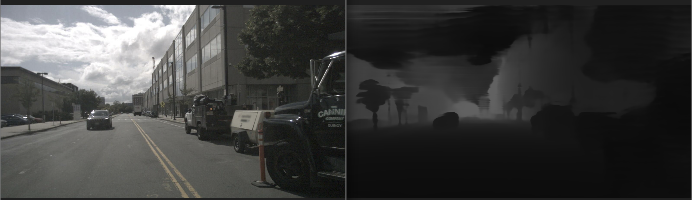
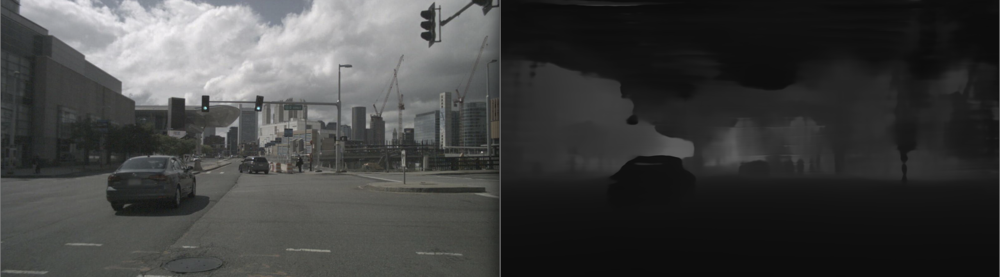
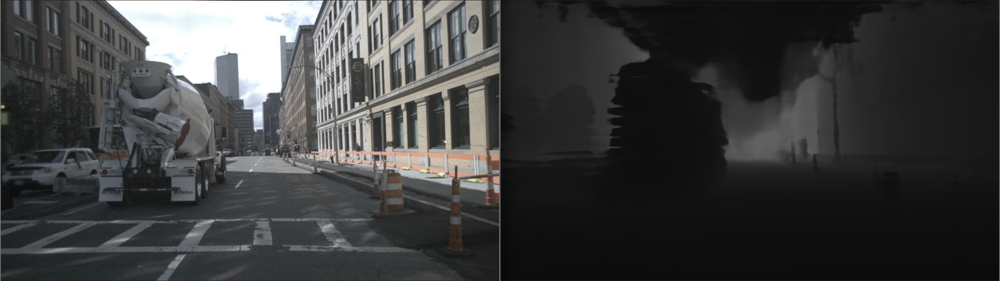
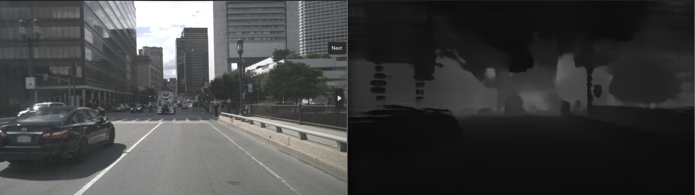
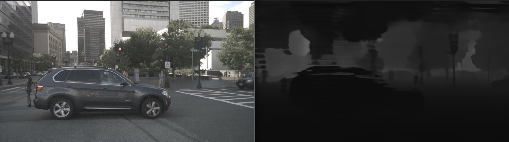
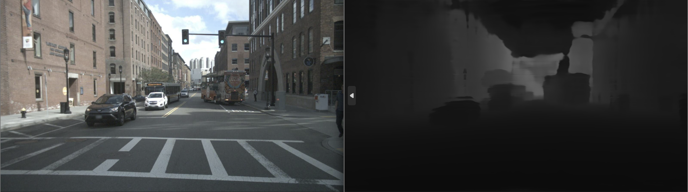

# Depth Estimation from Camera Image and mmWave Radar Point Cloud

Pytorch implementation of Depth Estimation from Camera Image and mmWave Radar Point Cloud

## Setting up docker
Note: Using docker is an option if your host machine has ubuntu 20.04 OS. If you have OS other than Ubuntu, it is recommended to use docker. If you have Ubuntu in your machine and like to use that instead of docker, proceed [here](#setting-up-environment)

1. Go through the [Documentation](https://docs.docker.com/desktop/) to install and start the docker engine.

2. Once, docker engine is installed ans started, use the following command to get ubuntu docker image:

```
docker pull ubuntu:<version-number>
```
3. After pulling the ubuntu docker image, make sure the image or container is running. 

4. If the docker container is not running, then use the follwing command to run the container and use it:
```
docker run --gpus all -it --shm-size=16g ubuntu:<tag>
```
5. initially, at first run of docker image, the tag will be the version number used for pulling ubuntu container/image.

6. After running the container, we will notice that the user of the image is named root in the format follows:
```
root@<container-id>:/#
```
7. Here, note the container-id to save all the progress later on.

8. As the container is running and ready to use now, proceed [Here](#setting-up-environment) to work on.
9. After working, to avoid loss of the progress and save the content worked on, exit the docker using:
```
exit
```
10. Now, start the docker container in which the work was done:
```
docker start <container-id>
```
11. Look of the name of the container by identifying it using the container-id in list of containers. To get the list use command:
```
docker ps
```
12. After noting down the name of container worked on, commit the changes or content in the container using:
```
docker commit <image-name> ubuntu:<tag>
```
13. Here, the tage can be anything of user's choice. But remember the tage to use the container with saved progress in future.

14. After commiting changes, stop the docker using:
```
docker stop <image-name>
```
15. If you wish to have the container to saved to the host machine, use the following command:
```
docker save ubuntu:<tag> > <name>.tar
```
16. To load this file(container), use the follwing command:
```
docker load < <name>.tar
```

Note: The container-id, name of container always change each time we run the container. Only the tag won't change and using different tag name while commiting changes actually create another custom container leaving the one you use aside without deleting.

## Setting up environment
The following steps are used to setup favourable environment for the project to work properly.

1. Update the OS/docker image(ubuntu)
```
sudo apt-get update
```
2. Install all necessary packages and tools for ubuntu
```
sudo apt-get install wget
sudo apt-get install git
sudo apt-get install python3.8
sudo apt-get install pip
```
3. Now, clone this repository using following command:
```
git clone <>
```
4. Once cloning is complete, navigate into the cloned repository:
```
cd radar-camera-fusion-depth
```
5. Setup virtual environemnt and actiavte it:
```
pip install virtualenv
virtualenv -p /usr/bin/python3 cam_rad_fusion
source cam_rad_fusion/bin/activate
```
6. Now, prepare for the data which will be needed by the project.

7. If you are not using docker container, skip to **step 13**. If using docker, as there won't be any GUI navigate with usual flexibility, use the following command:
```
git clone https://github.com/DKandrew/NuScenes-Download-CLI.git
```
8. This repository contain commands and code blocks which help us to download the datasets and other necessary for the project.

9. Use the following commands, we can start donwloading the datasets:
```
cd NuScenes-Download-CLI
python download_nuscenes.py --username <username> --password <password>
sh download_commands.txt
```
10. Here, the username and password are the credentials of Nuscenes which you can register [Here](https://www.nuscenes.org/sign-up?prevpath=nuscenes&prevhash=)

11. After, running the above bash command, use the following command to download datasets:
```
python extract_parallel.py
```
12. Downloads might take time as the data needed is huge.

13. Using a ubuntu system gives GUI flexibility. Hence, download data from [Here](https://www.nuscenes.org/nuscenes#download) and extract data.

## CUDA establishment

1. Use the following commands to setup the CUDA for the project:
```
wget https://developer.download.nvidia.com/compute/cuda/repos/ubuntu2004/x86_64/cuda-ubuntu2004.pin
mv cuda-ubuntu2004.pin /etc/apt/preferences.d/cuda-repository-pin-600
wget https://developer.download.nvidia.com/compute/cuda/11.3.0/local_installers/cuda-repo-ubuntu2004-11-3-local_11.3.0-465.19.01-1_amd64.deb
dpkg -i cuda-repo-ubuntu2004-11-3-local_11.3.0-465.19.01-1_amd64.deb
sudo apt-key add /var/cuda-repo-ubuntu2004-11-3-local/7fa2af80.pub
sudo apt-get update
sudo apt-get -y install cuda
```
2. If faced with any error while establishing, refer and go through the steps from [here](https://developer.nvidia.com/cuda-11.3.0-download-archive?target_os=Linux&target_arch=x86_64&Distribution=Ubuntu&target_version=20.04&target_type=deb_local).

## Torch setup

1. Follow the steps to setup Pytorch which is compatible with the CUDA and python version established.
```
pip install torch==1.11.0+cu113 torchvision==0.12.0+cu113 torchaudio==0.11.0 --extra-index-url https://download.pytorch.org/whl/cu113
```

This will install and setup **torch(1.11.0+cu113), torchvision(0.12.0+cu113) and torchaudio(0.11.0)** 

## Detectron2 setup

1. Detectron2 was built by FAIR (Facebook AI Research) to support radin implementation and evaluation of novel computer vision research which includes implementation object detection algorithms.

2. Detectron2 can be setup by using the commands:
```
git clone https://github.com/facebookresearch/detectron2.git
python -m pip install -e detectron2
```

## NuScenes dev-kit setup
1. To process and work with Nuscenes data, we need Nuscenes dev-kit module installed. It can be installed by using
```
pip install nuscenes-devkit
```
## Packages and modules setup
1. After all the main setup is done, now we need to install remaining packages and modules need to the project. They can be installed by using the following command:
```
pip install -r requirements.txt
```
2. This will ensure all the necessary packages are insatlled.

3. Due to various versions of different package and there nessecity of 0ther packages, **scikit** module may not be detected. If this happens, install the package by using following command:
```
pip install scikit-image
```
4. With this all the setup for proceeding to work with the project are complete.

## Implementation
1. As all the setup is done, now we need arrage datasets in place, in order for the project to identify and run properly.

2. Inside th project directory/project root diretory, create a directory named "**data**" and again create a directory named "**nuscenes**" inside the **data** directory.

3. Now, the datasets were downloaded using **NuScenes-Download-CLI**, copy the datasets from the **downlods**, which is inside **NuScenes-Download-CLI** to the **nuscenes** directory inside **data** directory.

4. If the datasets are downloaded using browser, then directly copy to **nuscenes** directory.

5. Now, Generate the panoptic segmentation masks using the following:
```
python setup/gen_panoptic_seg.py
```

6. Run the following bash script to generate the preprocessed dataset for training and testing:

```
bash bash/setup_dataset_nuscenes.sh
bash bash/setup_dataset_nuscenes_test.sh
```

7. The preprocessed datasets will be stored in "**data/nuscenes_derived**" directory 

8. Now, train RadarNet using the nuscenes dataset using:
```
bash bash/train_radarnet_nuscenes.sh
```

9. After training, setup dataset for FusionNet:
```
bash bash/setup_dataset_nuscenes_radarnet.sh
bash bash/setup_dataset_nuscenes_radarnet_test.sh
```

10. After prepapring, train FusionNet using the following command:
```
bash bash/train_fusionnet_nuscenes.sh
```

11. We can even use pre-trained models instead of training the models from [here](https://drive.google.com/drive/folders/1uVhpnX7A-xz73w_8ZBfeGgit4hGpuKcN?usp=sharing)

12. Finally, we can evaluate the model using:
```
bash bash/run_fusionnet_nuscenes_test.sh
```

Note: Remember to execute all the above commands from project root directory.

## Results
Below are some of the produced results of this project

1)


2)


3)


4)


5)


6)



